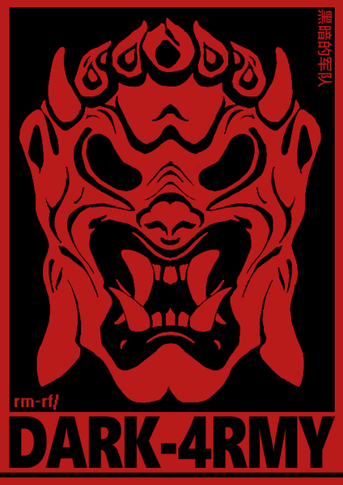

<h1 align="center">🖥️ Wilstan — Systems & Network Student</h1>

  

<pre><code>
git clone m0bley-git
cd systems-and-networks
./build.sh --linux --c --learning
</code></pre>

---

## 🧠 About me
I’m Wilstan, 18.  
Based in France.  
Student in BTS CIEL, focused on systems, networks, and low-level programming.  
I mainly work on Linux, code in C/C++ and HTML/CSS, and build small technical and self-hosted projects.

---

## 🔧 Projects

- [**Projets_WJH**](https://github.com/SpectresAPT/Projets_WJH) — Weather Judgment Hub: small app using APIs and manual input  
  *Tech:* C++ & QT

---

## 💻 Tech Stack

<pre><code>
VS Code • Vim • Obsidian • C++ • C • Java • HTML • CSS • Linux • Red Hat • Git • GitLab
</code></pre>

---

## 🎯 Goal
- Join 42 Angoulême
- Strengthen low-level programming skills
- Build reliable Linux-based systems

  
<pre><code>
# still learning, still building
git commit -m "progress > perfection"
</code></pre>

