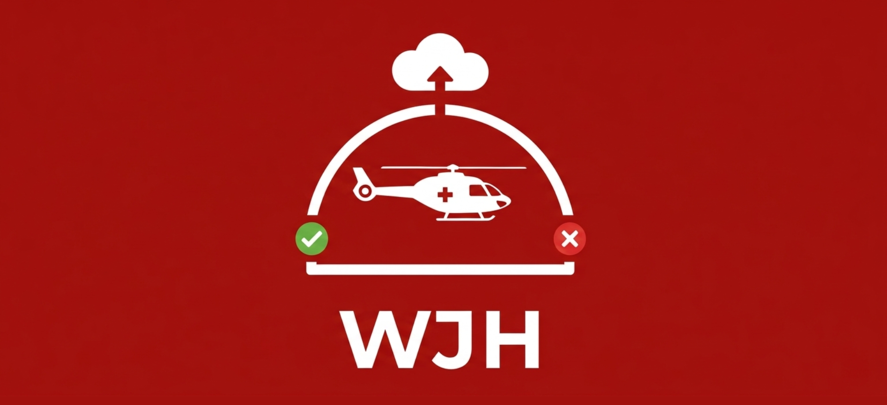
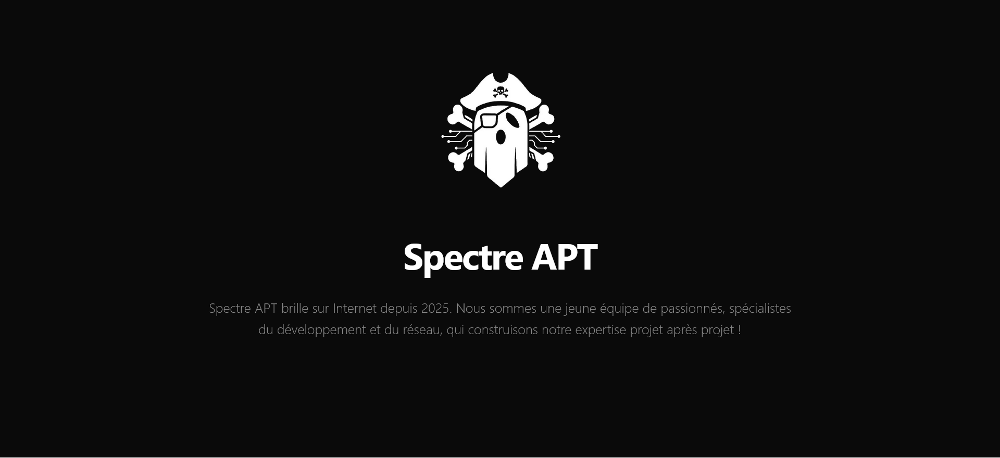
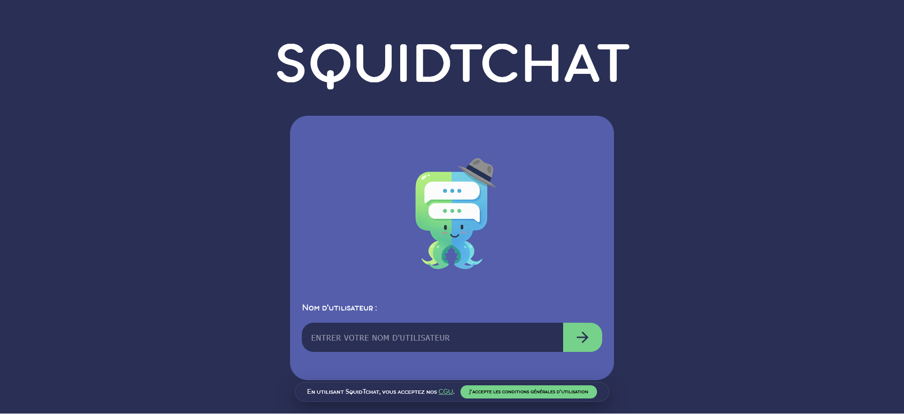
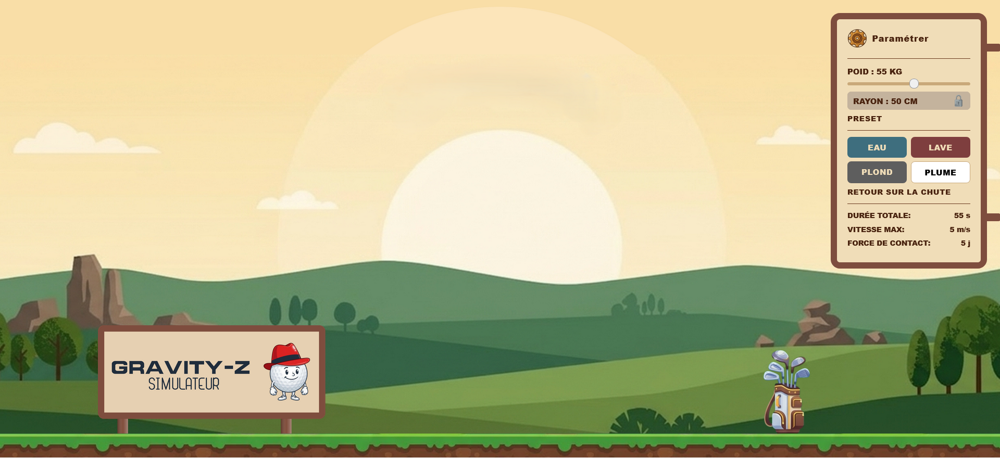

## 💻 Tech Stack

## Français 🇫🇷

### Étudiant en BTS CIEL — Systèmes & Réseaux

<strong>
Je me forme à la programmation, à l’administration Linux et aux infrastructures réseau. 
Je conçois des projets techniques, déploie des services web et expérimente autour de l’open source. 
Curieux, autonome et toujours en train d’apprendre.

</strong>

📬 [Me contacter via GitHub Discussions](https://github.com/sawlvl/sawlvl/discussions?discussions_q=category%3AGuestbook)

## English 🇬🇧

### BTS CIEL Student — Systems & Networks

<strong>
Training in programming, Linux system administration and networking. 
I build technical projects, deploy web services and explore open-source technologies. 
Always learning, always building.

</strong>

📬 [Contact me via GitHub Discussions](https://github.com/sawlvl/sawlvl/discussions?discussions_q=category%3AGuestbook)

## 🔧 Projects

<table width="80%" align="center">
  <tr>
    <td align="center" width="50%"><strong>Projets_WJH</strong></td>
    <td align="center" width="50%"><strong>SpectreAPT Web</strong></td>
  </tr>
  <tr>
    <td align="center">
      
    </td>
    <td align="center">
      
    </td>
  </tr>
  <tr>
    <td align="center" width="50%"><strong>SquidTchat</strong></td>
    <td align="center" width="50%"><strong>Gravity-Z</strong></td>
  </tr>
  <tr>
    <td align="center">
      
    </td>
    <td align="center">
      
    </td>
  </tr>
</table>

## 📊 Badges

