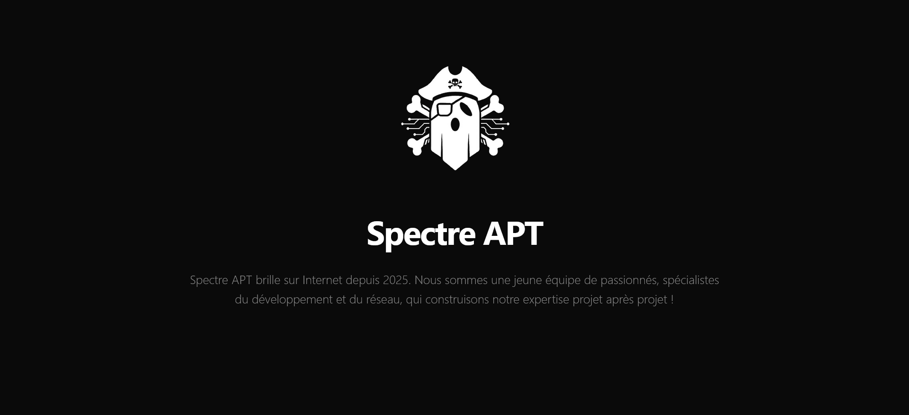

## 💻 Tech Stack

---

## Français 🇫🇷
### Étudiant en BTS CIEL, spécialité systèmes et réseaux.
#### J'apprends la programmation, l'administration de serveurs Linux et la gestion de réseaux.
#### Je développe de petits projets techniques, je déploie et héberge des sites web sur différentes plateformes, et j'explore le monde de l'open source.
#### Toujours en apprentissage, toujours en progression.
#### 📬 [Laisse-moi un message via GitHub Discussion](https://github.com/m0bley-git/m0bley-git/discussions?discussions_q=category%3AGuestbook)

## English 🇬🇧
### BTS CIEL student, specialized in systems and networks.
#### Learning programming, Linux server administration and network management.
#### I develop small technical projects, deploy and host websites on various platforms, and explore the open source world.
#### Always learning, always progressing.
#### 📬 [Leave me a message via GitHub Discussion](https://github.com/m0bley-git/m0bley-git/discussions?discussions_q=category%3AGuestbook)

---

## 🔧 Projects

<table width="80%" align="center">
  <tr>
    <td align="center" width="50%"><strong>Projets_WJH</strong></td>
    <td align="center" width="50%"><strong>SpectreAPT Web</strong></td>
  </tr>
  <tr>
    <td align="center">
      
    </td>
    <td align="center">
      
    </td>
  </tr>
</table>

---

## 📊 Badges

